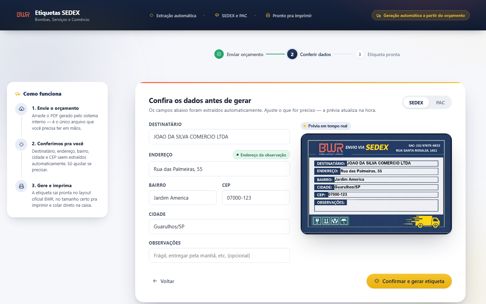
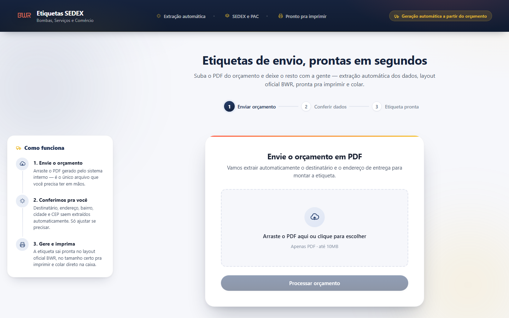
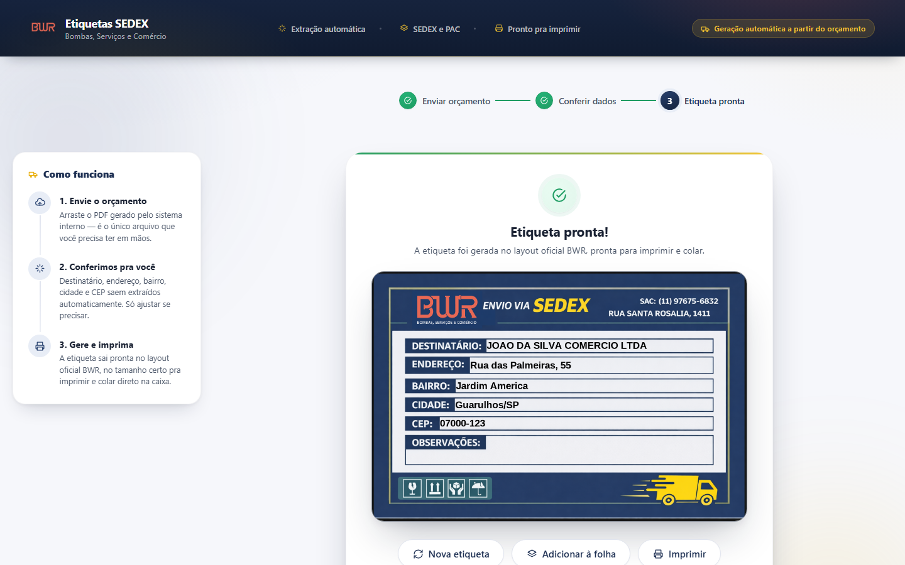

# Etiquetas SEDEX — BWR

Sistema de geração automática de etiquetas de envio (SEDEX e PAC) a partir do PDF do orçamento de uma transportadora. Substitui um processo manual feito no Word: sobe o PDF, o sistema extrai o destinatário e o endereço sozinho, você confere/ajusta numa prévia em tempo real, e baixa/imprime a etiqueta pronta no layout oficial da empresa.



## Por que esse projeto é interessante

Não é um CRUD. Tem um problema real de negócio no meio: o PDF do orçamento tem dois lugares possíveis pra endereço — um formato fixo no topo, e um campo de observação em **texto livre, sem padrão**, escrito à mão por pessoas diferentes, que quando presente tem prioridade sobre o do topo. Resolvi isso com:

- **Regex** para o formato fixo (rápido, determinístico, sem custo).
- **LLM** (Gemini/Groq, trocável por configuração) só para o texto livre — e só quando um pré-filtro barato (regex) indica que vale a pena gastar a chamada.
- Uma **regra de negócio pura** (`priorizar_endereco`) decidindo qual endereço vence, isolada de qualquer detalhe de implementação — testável sem subir servidor, sem mockar nada.

## Screenshots

| Upload | Conferência (prévia ao vivo) | Etiqueta pronta |
|---|---|---|
|  |  |  |

## Stack

**Backend** — Python 3.12+, FastAPI, pdfplumber (extração de PDF), Pillow (geração da imagem da etiqueta), clientes HTTP próprios para Groq/Gemini.

**Frontend** — React 19, TypeScript, Vite, CSS Modules (sem framework de UI — design system próprio).

**Testes** — pytest (backend, incluindo testes de integração via `TestClient`) e Vitest + Testing Library (frontend).

**CI** — GitHub Actions rodando testes e build a cada push/PR ([`.github/workflows/ci.yml`](.github/workflows/ci.yml)).

## Arquitetura

O backend segue Clean Architecture, com a regra de dependência sempre apontando pra dentro:

```
backend/app/
  domain/            # entidades e regras de negócio puras — zero import de FastAPI, Pillow, HTTP etc.
    entities.py         Endereco, Orcamento, Etiqueta
    ports.py             interfaces (Protocol) que a infraestrutura implementa
    address_prioritizer.py   regra: observação tem prioridade sobre o topo
    observacao_heuristics.py  pré-filtro: vale a pena chamar o LLM?
    sanitization.py          sanitiza entrada antes de desenhar na etiqueta

  application/       # casos de uso — orquestram domínio + portas, nada de detalhe concreto
    processar_orcamento.py
    gerar_etiqueta.py

  infrastructure/    # implementações concretas das portas do domínio
    pdf/                 pdfplumber + parser de regex do formato fixo
    llm/                  clientes Groq e Gemini atrás da mesma interface
    image/                renderizador Pillow (SEDEX e PAC, coordenadas calibradas em pixel)

  presentation/      # FastAPI: rotas, schemas Pydantic, injeção de dependência, tratamento de erro
```

**Por que isso importa na prática**: trocar de Groq pra Gemini é uma linha de config (`LLM_PROVIDER=gemini`), não uma reescrita — os dois implementam `ExtratorEnderecoLLMPort`. Testar a regra de priorização de endereço não precisa de PDF, de rede, nem de servidor rodando.

O frontend não usa Redux/Context — o estado do fluxo (upload → conferência → pronta) vive no componente raiz (`App.tsx`) e desce via props; a lógica pura (montagem de nome de arquivo, ajuste de fonte do canvas) fica em módulos/hooks separados, testados isoladamente do React.

## Testes

```bash
# backend — 40 testes (unitários de domínio + integração via TestClient)
cd backend && venv\Scripts\python.exe -m pytest -v

# frontend — 26 testes (componentes com Testing Library + funções puras)
cd frontend && npm test
```

O que os testes de integração do backend cobrem (com dublês de teste no lugar do LLM real, via `app.dependency_overrides` do FastAPI — sem chamada de rede nos testes):

- Endereço do topo usado quando a observação não tem indício de endereço
- Endereço da observação tem prioridade quando presente
- Upload rejeitado quando não é PDF / está vazio / não tem assinatura de PDF válida
- Erro interno não vaza detalhe (stack trace, mensagem da exceção) pro cliente
- Geração da etiqueta funciona para os dois layouts (SEDEX/PAC) e sanitiza conteúdo malicioso sem quebrar

## Segurança

- PDFs nunca são salvos em disco — lidos em memória, processados, descartados.
- Todo dado extraído do PDF (ou vindo do LLM) passa por sanitização antes de ir pra imagem: remove caracteres de controle e caracteres de override de direção de texto (usados em ataques de spoofing visual).
- Rate limiting nos endpoints de upload/geração.
- Chaves de API nunca tocam o frontend — toda chamada de LLM passa pelo backend.
- Erros não vazam stack trace, path ou detalhe interno pro cliente (com teste garantindo isso).

## Como rodar localmente

```bash
# backend
cd backend
python -m venv venv
venv\Scripts\pip install -r requirements.txt -r requirements-dev.txt
copy .env.example .env
venv\Scripts\python.exe -m uvicorn app.presentation.main:app --reload --port 8000

# frontend (outro terminal)
cd frontend
npm install
npm run dev
```

Acesse `http://localhost:5173`. Sem uma chave de LLM configurada no `.env`, o sistema funciona normalmente — só não tenta extrair endereço da Observação, usa sempre o do topo.

## Deploy (servidor interno)

O backend serve tanto a API quanto o frontend já compilado — em produção roda um único processo. Detalhes de infraestrutura (Windows Service via NSSM, por quê, portas, logs) estão documentados separadamente porque são específicos do ambiente de produção da empresa — veja [`docs/DEPLOY.md`](docs/DEPLOY.md).

## Decisões de design que valem mencionar

- **Prévia no cliente espelha o resultado do servidor pixel a pixel**: o frontend desenha a prévia num `<canvas>` usando as mesmas coordenadas e o mesmo algoritmo de ajuste de fonte (reduz até caber, trunca com reticências como último recurso) que o backend usa com Pillow — sem duplicar constantes mágicas, o backend expõe o layout via `GET /api/etiquetas/layout`.
- **Dois templates de etiqueta (SEDEX/PAC), uma arquitetura**: adicionar o segundo layout foi só registrar um novo `TemplateEtiqueta` com suas coordenadas — nenhuma regra de negócio ou rota mudou.
- **Fila de impressão sem duplicar lógica de extração**: agrupar até 4 etiquetas numa folha só reaproveita etiquetas já geradas e confirmadas individualmente — a decisão consciente foi *não* deixar conferir múltiplos orçamentos de uma vez, pra não criar uma tela onde é fácil trocar o endereço de um cliente pelo de outro sem perceber.
